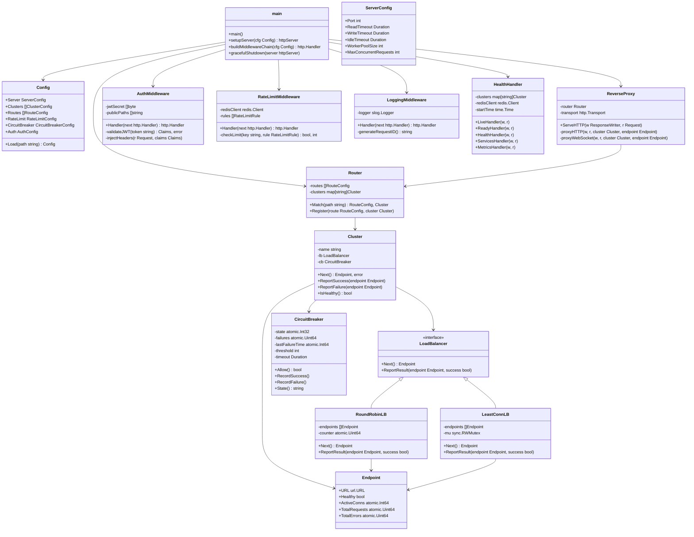
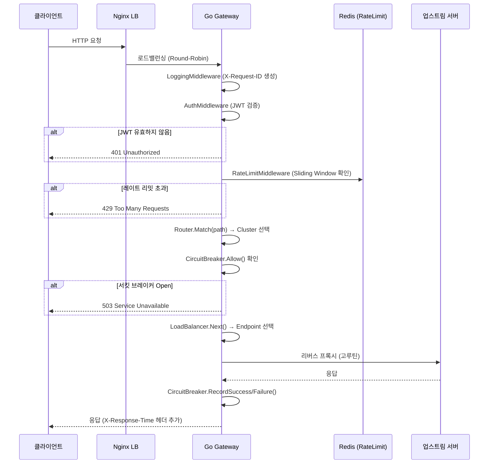

# API Gateway — 아키텍처 구조도

> **언어:** Go 1.22 | **위치:** `infra/gateway/` | **이전:** `servers/gateway/` (C# → Go 마이그레이션)

---

## 디렉토리 구조

```
infra/gateway/
├── main.go                      # 엔트리포인트, 고루틴 워커풀, Graceful Shutdown
├── go.mod                       # Go 모듈 정의
├── Dockerfile                   # 멀티스테이지 빌드 (builder → distroless)
├── config/
│   ├── config.go                # YAML 설정 로더 및 구조체 정의
│   └── gateway.yaml             # 전체 라우팅/클러스터/레이트리밋/서킷브레이커 설정
├── proxy/
│   ├── proxy.go                 # 고루틴 기반 리버스 프록시 핸들러 (HTTP + WebSocket)
│   ├── router.go                # 경로 매칭 및 클러스터 선택 라우터
│   ├── loadbalancer.go          # Round-Robin / Least-Connection 로드밸런서
│   └── context_keys.go          # 컨텍스트 키 상수 (순환 참조 방지)
├── middleware/
│   ├── auth.go                  # JWT 검증 및 역할 기반 접근 제어
│   ├── ratelimit.go             # Redis 기반 슬라이딩 윈도우 레이트 리밋
│   ├── circuitbreaker.go        # 서킷 브레이커 (Closed/Open/Half-Open)
│   └── logging.go               # 구조화 로깅 및 요청 추적 (X-Request-ID)
└── health/
    └── health.go                # 헬스체크 엔드포인트 + 업스트림 상태 모니터링
```

---

## 클래스 구조도



---

## 요청 처리 흐름



---

## 고가용성(HA) 구성

### 로컬 개발 환경 (`infra/docker/local-all.yml`)

단일 Gateway 인스턴스로 구성됩니다.

```
클라이언트 → Gateway(:8080) → 업스트림 서버들
```

### 스테이징/운영 환경 (`infra/docker/gateway-ha.yml`)

3개 Gateway 인스턴스 + Nginx 로드밸런서 + Redis Sentinel HA로 구성됩니다.

```
클라이언트
    │
    ▼
Nginx LB(:80/:443)          ← Active-Active, least_conn
    ├── gateway-1(:18081)
    ├── gateway-2(:18082)
    └── gateway-3(:18083)
         │
         ▼
Redis Sentinel HA
    ├── redis-master(:6379)
    ├── redis-sentinel-1
    ├── redis-sentinel-2
    └── redis-sentinel-3
```

### Kubernetes (`infra/k8s/gateway/deployment.yaml`)

| 리소스 | 설정 |
|---|---|
| Deployment replicas | 3 (최소) |
| HPA | CPU 70% 기준, 최대 10 Pod |
| PodDisruptionBudget | minAvailable: 2 |
| Resources | requests: 100m CPU / 128Mi, limits: 2000m CPU / 512Mi |
| Liveness Probe | `GET /live` (10s interval) |
| Readiness Probe | `GET /ready` (5s interval) |
| Rolling Update | maxSurge: 1, maxUnavailable: 0 (무중단 배포) |

---

## 고루틴 기반 성능 설계

### 워커풀 구조

```go
// main.go — 고루틴 워커풀 (요청 처리)
workerPool := make(chan struct{}, cfg.Server.MaxConcurrentRequests)

handler := http.HandlerFunc(func(w http.ResponseWriter, r *http.Request) {
    select {
    case workerPool <- struct{}{}:
        defer func() { <-workerPool }()
        baseHandler.ServeHTTP(w, r)
    default:
        // 워커풀 포화 시 즉시 503 반환 (큐 대기 없음)
        http.Error(w, `{"error":"overloaded"}`, http.StatusServiceUnavailable)
    }
})
```

### 핵심 성능 설정

| 항목 | 기본값 | 설명 |
|---|---|---|
| `GOMAXPROCS` | 0 (CPU 코어 수) | Go 런타임 병렬 스레드 수 |
| `GOMEMLIMIT` | 512MiB | 메모리 한도 (OOM 방지) |
| `MaxConcurrentRequests` | 10,000 | 동시 처리 요청 수 |
| `ReadTimeout` | 30s | 요청 읽기 타임아웃 |
| `WriteTimeout` | 30s | 응답 쓰기 타임아웃 |
| `IdleTimeout` | 120s | Keep-Alive 유휴 타임아웃 |
| `MaxIdleConnsPerHost` | 100 | 업스트림별 유휴 연결 풀 크기 |

### Graceful Shutdown

```go
// SIGTERM/SIGINT 수신 시 진행 중인 요청 완료 후 종료
shutdownCtx, cancel := context.WithTimeout(context.Background(), 30*time.Second)
defer cancel()
server.Shutdown(shutdownCtx)
```

---

## C# → Go 마이그레이션 변경 사항

| 항목 | C# (구) | Go (신) |
|---|---|---|
| 위치 | `servers/gateway/` | `infra/gateway/` |
| 포트 | 5000 | 8080 |
| 메트릭 포트 | 없음 | 9090 (Prometheus) |
| 레이트 리밋 | Redis 기반 | Redis Sliding Window (Lua 스크립트) |
| 서킷 브레이커 | 없음 | per-cluster (Closed/Open/Half-Open) |
| 로드 밸런싱 | 없음 | Round-Robin / Least-Connection |
| WebSocket | 없음 | 지원 (chat-cluster) |
| HA 구성 | 없음 | Nginx + 3 인스턴스 + Redis Sentinel |
| 동시 처리 | ASP.NET 스레드풀 | 고루틴 워커풀 (10,000 동시) |
| Graceful Shutdown | 없음 | 30초 유예 후 종료 |

---

## 의존성

| 패키지 | 버전 | 용도 |
|---|---|---|
| `github.com/golang-jwt/jwt/v5` | v5.2.1 | JWT 검증 |
| `github.com/redis/go-redis/v9` | v9.5.1 | Redis 레이트 리밋 |
| `github.com/gorilla/websocket` | v1.5.1 | WebSocket 프록시 |
| `gopkg.in/yaml.v3` | v3.0.1 | YAML 설정 파일 파싱 |

---

## 관련 문서

- [API 명세서](../api/GATEWAY_API.md)
- [고가용성 Docker Compose](../../infra/docker/gateway-ha.yml)
- [Kubernetes 매니페스트](../../infra/k8s/gateway/deployment.yaml)
- [Nginx 설정](../../infra/docker/configs/nginx-gateway.conf)
- [Redis Sentinel 설정](../../infra/docker/configs/redis-sentinel.conf)
